# Activity Diagram (PlantUML) - SIMKINERJA

## 1. Activity Diagram Login

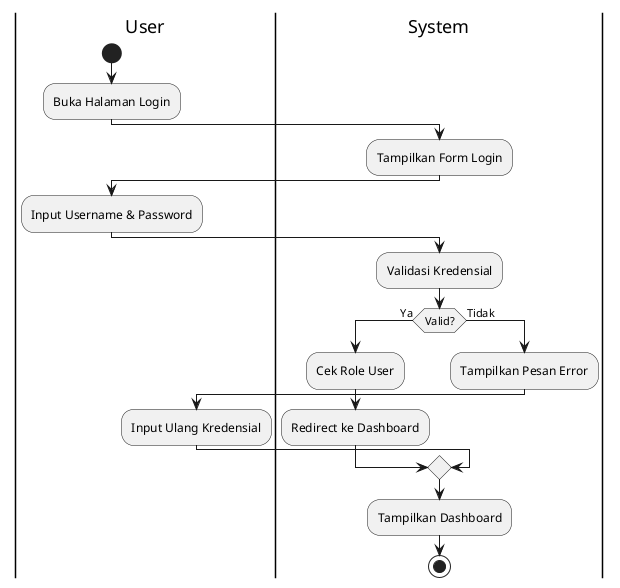

---

## 2. Activity Diagram Buat Kegiatan (Pelaksana)

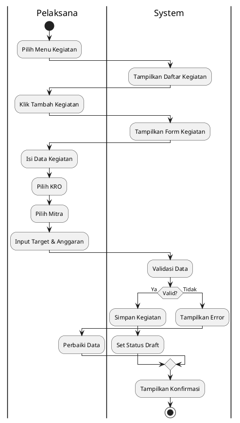

---

## 3. Activity Diagram Input Progres (Pelaksana)

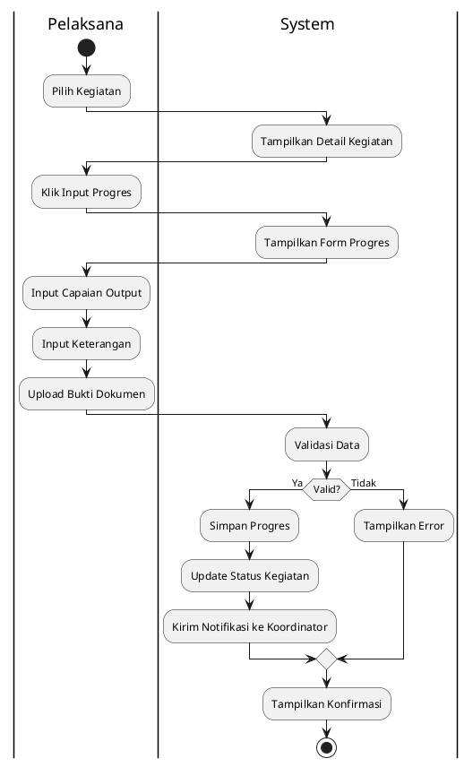

---

## 4. Activity Diagram Ajukan Validasi (Pelaksana)

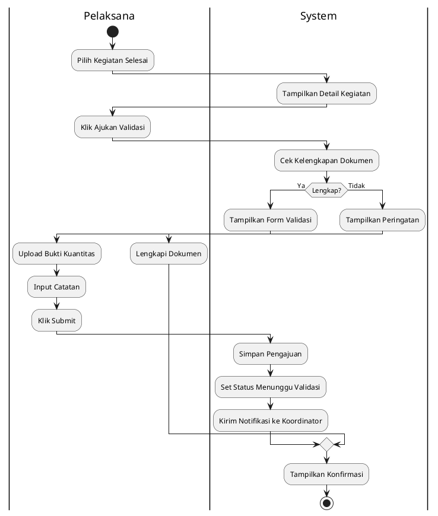

---

## 5. Activity Diagram Validasi Output (Koordinator)

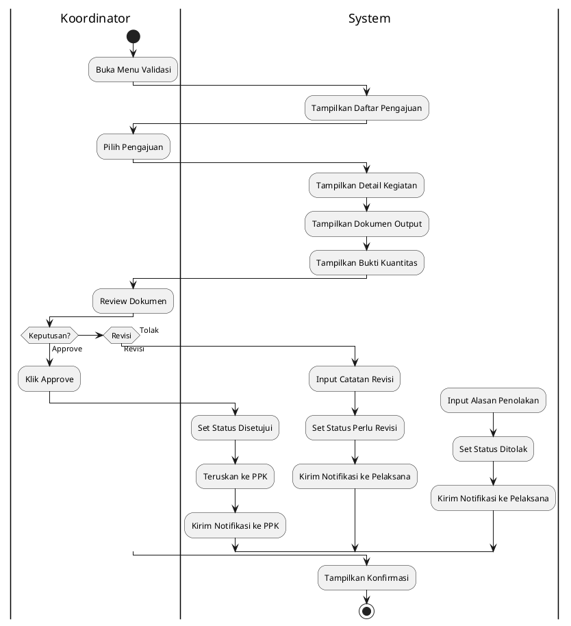

---

## 6. Activity Diagram Verifikasi Anggaran (PPK)

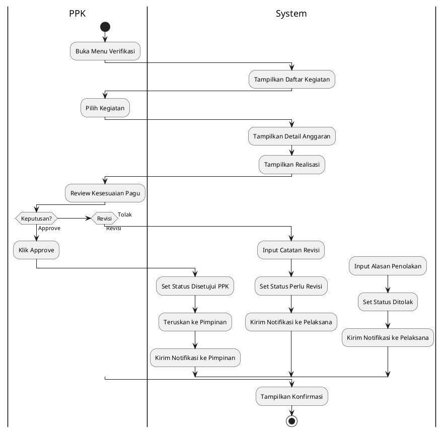

---

## 7. Activity Diagram Pengesahan Final (Pimpinan)

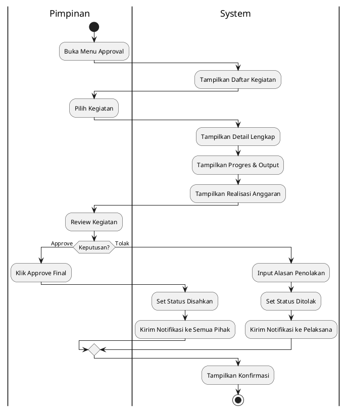

---

## 8. Activity Diagram Evaluasi Kinerja (Pimpinan)

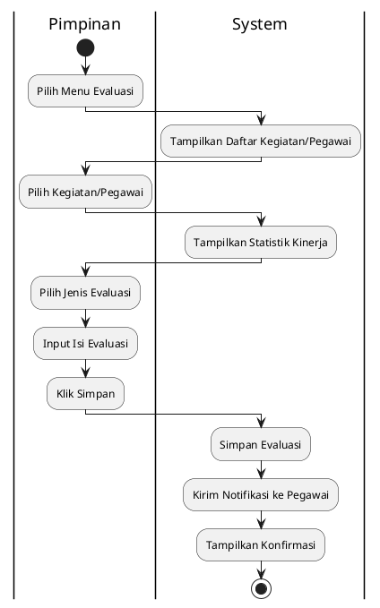

---

## 9. Activity Diagram Kelola Data Master (Admin)

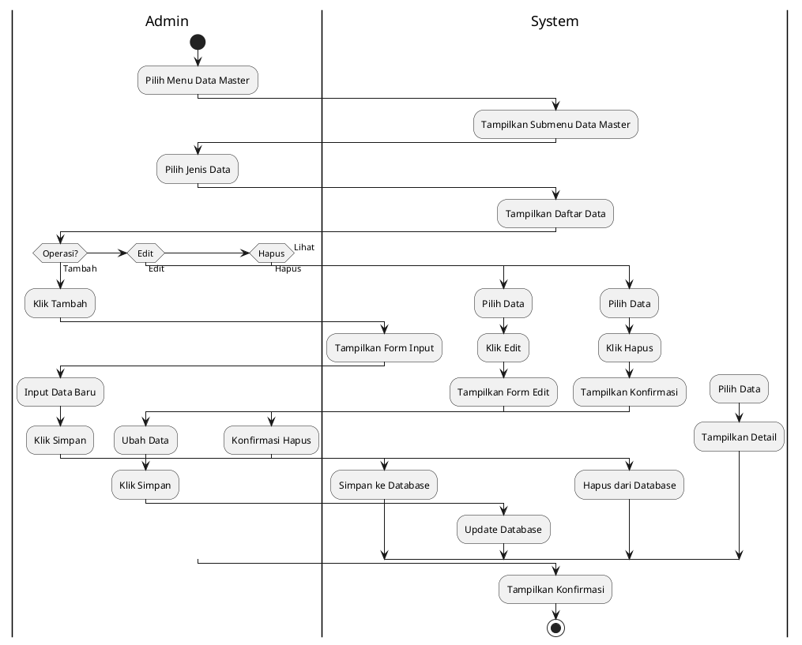

---

## 10. Activity Diagram Lapor Kendala (Pelaksana)

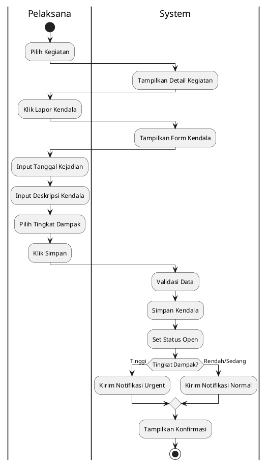

---

## 11. Activity Diagram Alur Approval Lengkap

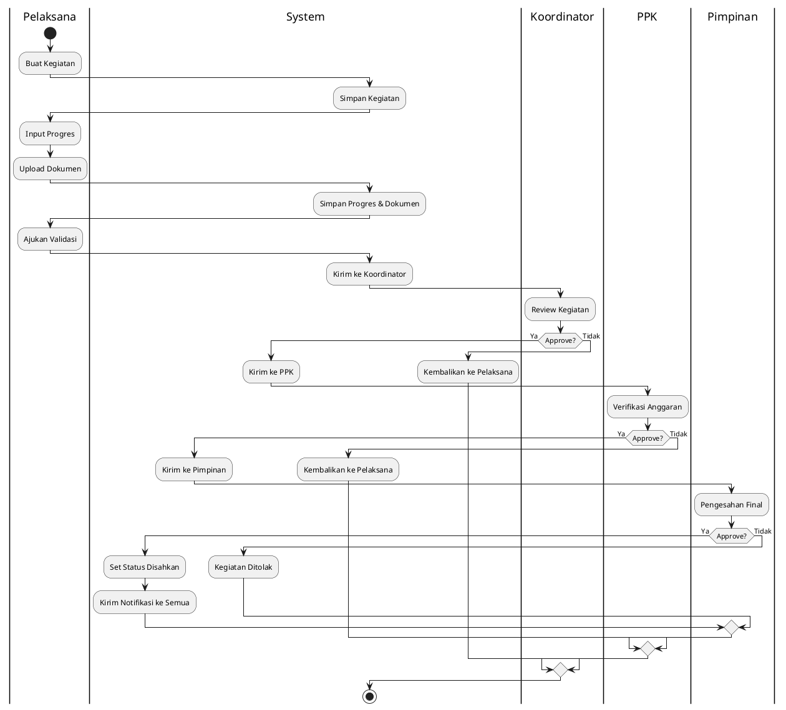

---

## Cara Melihat Diagram

1. Copy kode PlantUML di atas
2. Buka [PlantUML Online Editor](https://www.plantuml.com/plantuml/uml/)
3. Paste kode untuk melihat visualisasi diagram

---

## Keterangan Simbol PlantUML

| Simbol                     | Arti                       |
| -------------------------- | -------------------------- |
| `start`                    | Titik awal (Initial Node)  |
| `stop`                     | Titik akhir (Final Node)   |
| `:text;`                   | Activity / Action          |
| `if...then...else...endif` | Decision (Keputusan)       |
| `\|Swimlane\|`             | Swimlane (pembagian aktor) |
| `-->`                      | Control Flow               |
