# Activity Diagram (Mermaid) - SIMKINERJA

## 1. Activity Diagram Login

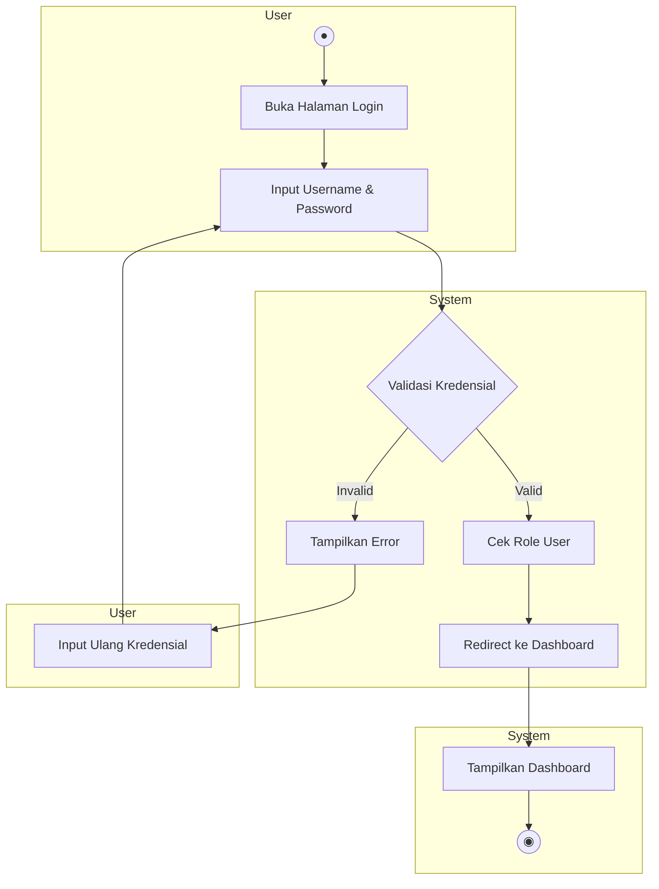

---

## 2. Activity Diagram Buat Kegiatan (Pelaksana)

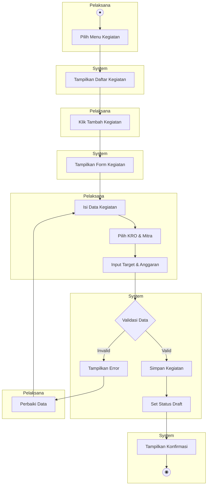

---

## 3. Activity Diagram Input Progres (Pelaksana)

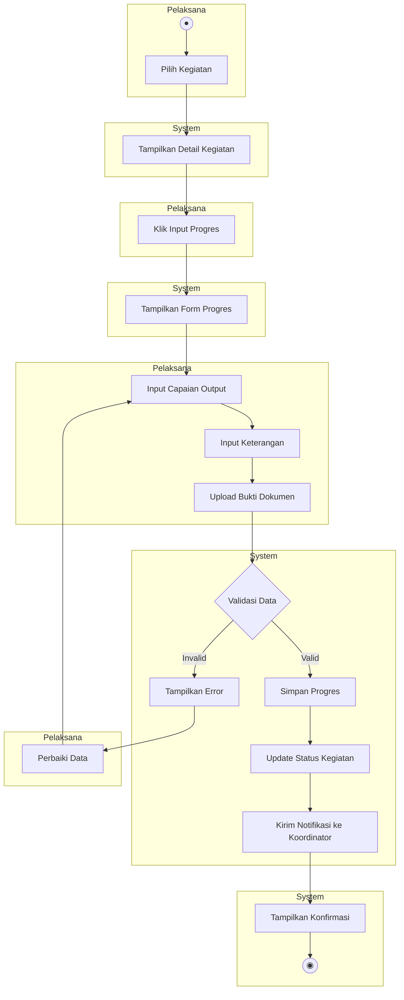

---

## 4. Activity Diagram Ajukan Validasi (Pelaksana)

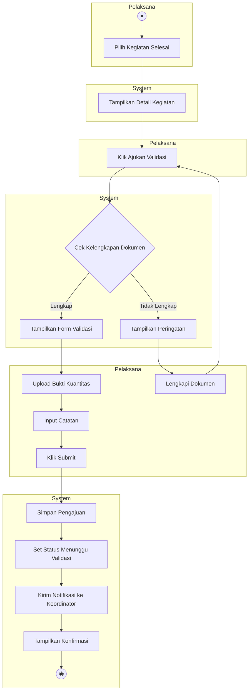

---

## 5. Activity Diagram Validasi Output (Koordinator)

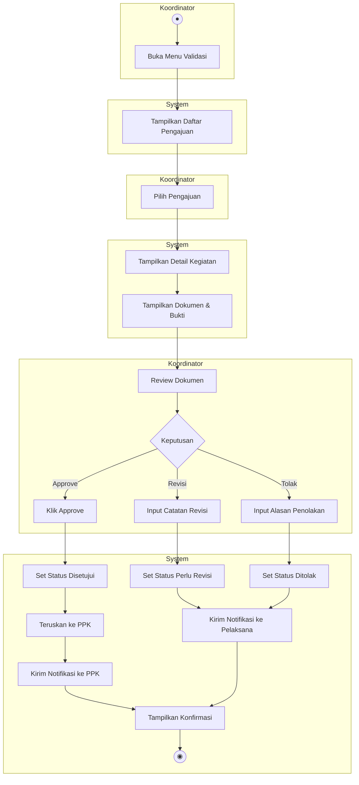

---

## 6. Activity Diagram Verifikasi Anggaran (PPK)

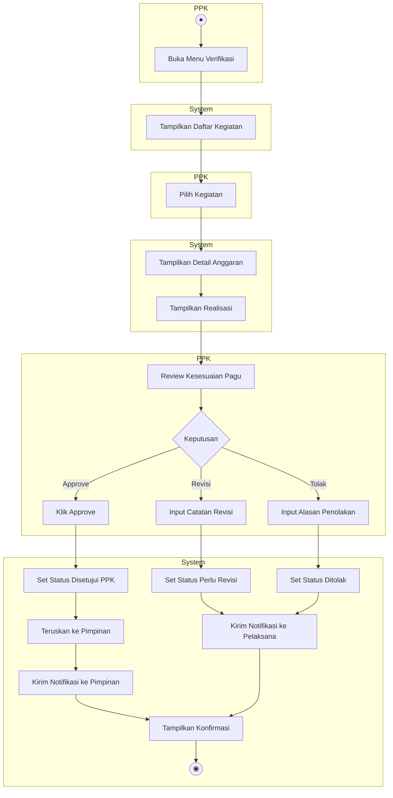

---

## 7. Activity Diagram Pengesahan Final (Pimpinan)

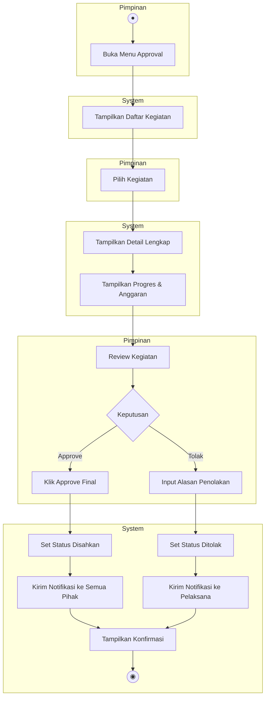

---

## 8. Activity Diagram Evaluasi Kinerja (Pimpinan)

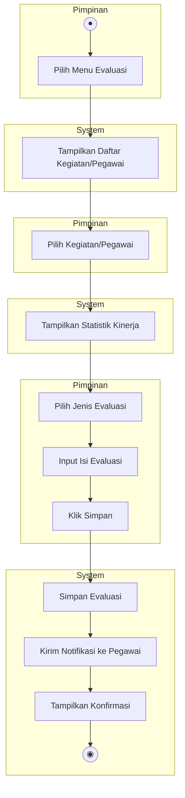

---

## 9. Activity Diagram Kelola Data Master (Admin)

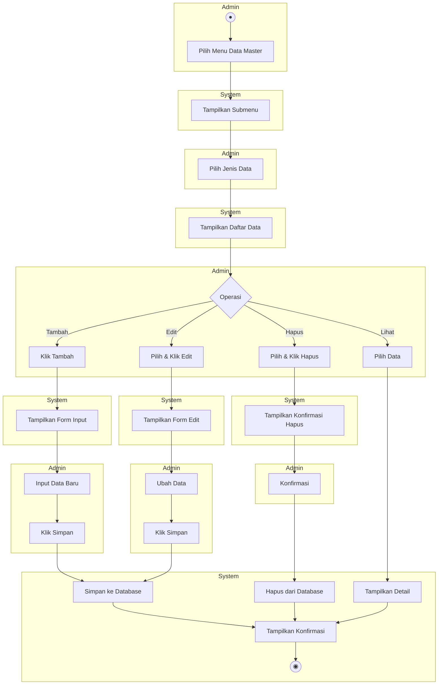

---

## 10. Activity Diagram Lapor Kendala (Pelaksana)

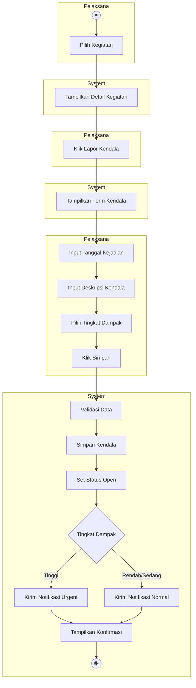

---

## 11. Activity Diagram Alur Approval Lengkap

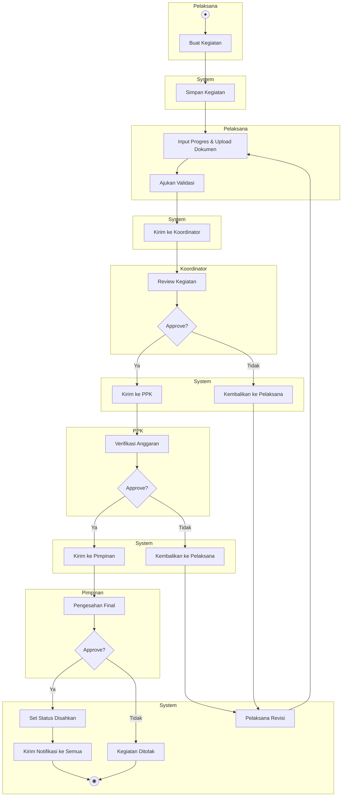

---

## Keterangan Simbol

| Simbol         | Arti                       |
| -------------- | -------------------------- |
| `((●))`        | Start (Initial Node)       |
| `((◉))`        | End (Final Node)           |
| `[ ]`          | Activity / Action          |
| `{ }`          | Decision (Keputusan)       |
| `subgraph`     | Swimlane (pembagian aktor) |
| `-->`          | Control Flow               |
| `-->\|label\|` | Flow dengan kondisi        |
