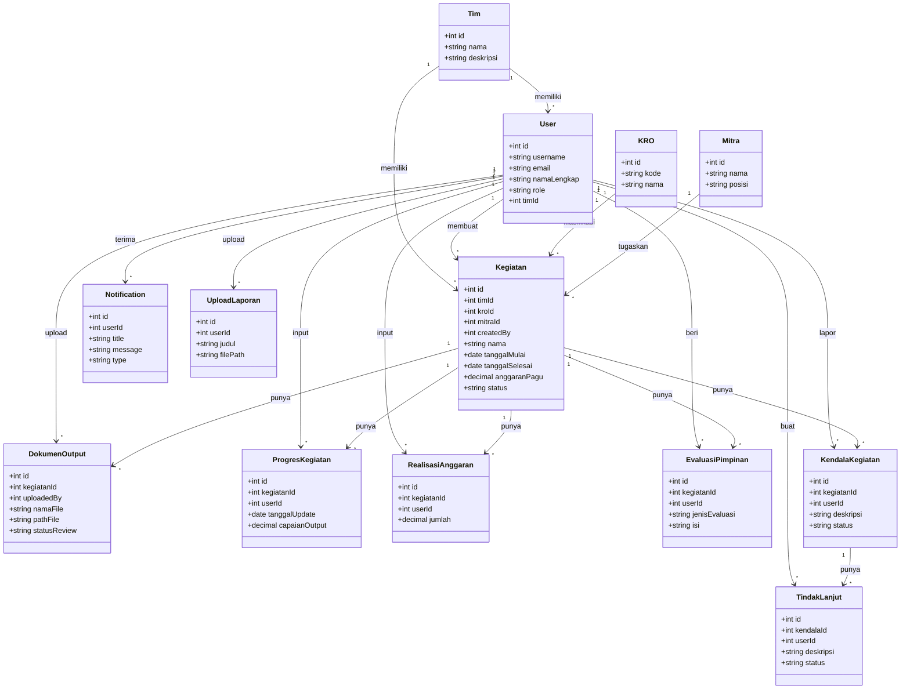

# Class Diagram - SIMKINERJA

## Class Diagram dengan Relasi

---

## Daftar Class dan Relasi

| No  | Class             | Deskripsi                  |
| --- | ----------------- | -------------------------- |
| 1   | Tim               | Tim/bagian organisasi      |
| 2   | User              | Pengguna sistem            |
| 3   | KRO               | Klasifikasi Rincian Output |
| 4   | Mitra             | Mitra statistik            |
| 5   | Kegiatan          | Kegiatan utama             |
| 6   | DokumenOutput     | Dokumen output kegiatan    |
| 7   | ProgresKegiatan   | Progres pelaksanaan        |
| 8   | RealisasiAnggaran | Realisasi anggaran         |
| 9   | EvaluasiPimpinan  | Evaluasi pimpinan          |
| 10  | KendalaKegiatan   | Kendala kegiatan           |
| 11  | TindakLanjut      | Tindak lanjut kendala      |
| 12  | Notification      | Notifikasi sistem          |
| 13  | UploadLaporan     | Upload laporan             |

---

## Daftar Relasi

| No  | Dari            | Ke                | Kardinalitas | Deskripsi                  |
| --- | --------------- | ----------------- | ------------ | -------------------------- |
| 1   | Tim             | User              | 1 : \*       | Tim memiliki User          |
| 2   | Tim             | Kegiatan          | 1 : \*       | Tim memiliki Kegiatan      |
| 3   | User            | Kegiatan          | 1 : \*       | User membuat Kegiatan      |
| 4   | User            | DokumenOutput     | 1 : \*       | User upload Dokumen        |
| 5   | User            | ProgresKegiatan   | 1 : \*       | User input Progres         |
| 6   | User            | RealisasiAnggaran | 1 : \*       | User input Realisasi       |
| 7   | User            | EvaluasiPimpinan  | 1 : \*       | User beri Evaluasi         |
| 8   | User            | KendalaKegiatan   | 1 : \*       | User lapor Kendala         |
| 9   | User            | TindakLanjut      | 1 : \*       | User buat TindakLanjut     |
| 10  | User            | Notification      | 1 : \*       | User terima Notifikasi     |
| 11  | User            | UploadLaporan     | 1 : \*       | User upload Laporan        |
| 12  | KRO             | Kegiatan          | 1 : \*       | KRO klasifikasi            |
| 13  | Mitra           | Kegiatan          | 1 : \*       | Mitra ditugaskan           |
| 14  | Kegiatan        | DokumenOutput     | 1 : \*       | Kegiatan punya Dokumen     |
| 15  | Kegiatan        | ProgresKegiatan   | 1 : \*       | Kegiatan punya Progres     |
| 16  | Kegiatan        | RealisasiAnggaran | 1 : \*       | Kegiatan punya Realisasi   |
| 17  | Kegiatan        | EvaluasiPimpinan  | 1 : \*       | Kegiatan punya Evaluasi    |
| 18  | Kegiatan        | KendalaKegiatan   | 1 : \*       | Kegiatan punya Kendala     |
| 19  | KendalaKegiatan | TindakLanjut      | 1 : \*       | Kendala punya TindakLanjut |

---

## Keterangan Simbol

| Simbol | Arti                 |
| ------ | -------------------- |
| `+`    | Public attribute     |
| `1`    | Exactly one          |
| `*`    | Zero or many         |
| `-->`  | Association (relasi) |
