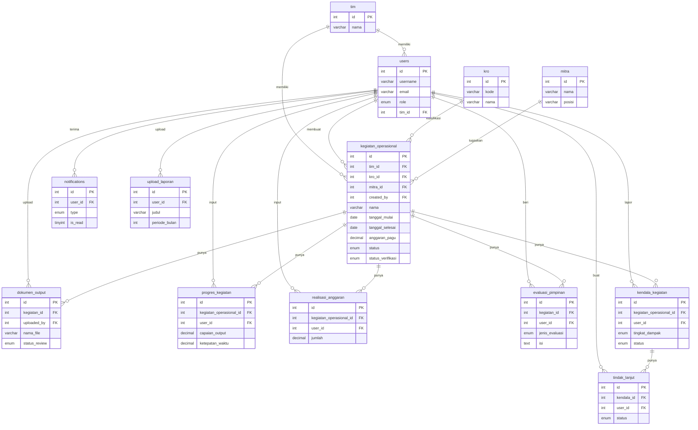

# Entity Relationship Diagram (ERD) - SIMKINERJA

## ERD Mermaid

---

## Ringkasan Relasi

| Entitas Utama            | Relasi ke                                                     |
| ------------------------ | ------------------------------------------------------------- |
| **tim**                  | users, kegiatan_operasional                                   |
| **users**                | kegiatan, dokumen, progres, realisasi, evaluasi, kendala, dll |
| **kro**                  | kegiatan_operasional                                          |
| **mitra**                | kegiatan_operasional                                          |
| **kegiatan_operasional** | dokumen, progres, realisasi, evaluasi, kendala                |
| **kendala_kegiatan**     | tindak_lanjut                                                 |

---

## Daftar 14 Entitas

| No  | Entitas              | Deskripsi Singkat                   |
| --- | -------------------- | ----------------------------------- |
| 1   | tim                  | Tim/bagian organisasi               |
| 2   | users                | Pengguna (admin/pimpinan/pelaksana) |
| 3   | kro                  | Klasifikasi Rincian Output          |
| 4   | mitra                | Mitra statistik                     |
| 5   | kegiatan_operasional | Kegiatan utama sistem               |
| 6   | dokumen_output       | Dokumen output kegiatan             |
| 7   | progres_kegiatan     | Progres pelaksanaan                 |
| 8   | realisasi_anggaran   | Realisasi anggaran                  |
| 9   | evaluasi_pimpinan    | Evaluasi dari pimpinan              |
| 10  | kendala_kegiatan     | Kendala yang dihadapi               |
| 11  | tindak_lanjut        | Tindak lanjut kendala               |
| 12  | notifications        | Notifikasi sistem                   |
| 13  | upload_laporan       | Upload laporan kinerja              |

---

## Keterangan

| Simbol     | Arti              |
| ---------- | ----------------- |
| PK         | Primary Key       |
| FK         | Foreign Key       |
| `\|\|--o{` | One-to-Many (1:N) |
