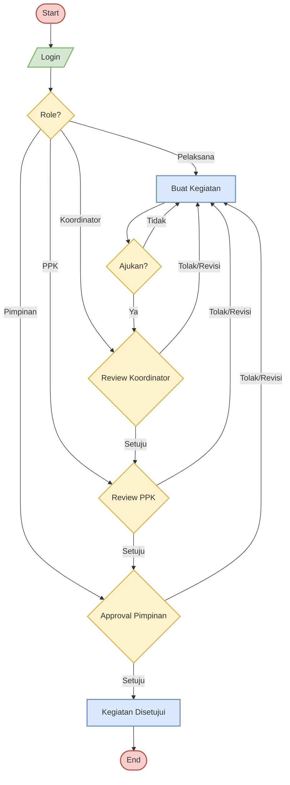
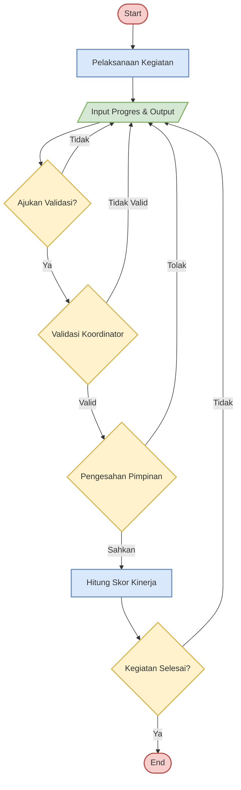

# Flowchart Sistem SimKinerja

## 1. Flowchart Alur Pembuatan Kegiatan

---

## 2. Flowchart Alur Validasi Output & Input Progres

---

## Penjelasan Alur

### Alur 1: Pembuatan Kegiatan

| Fase            | Proses                                          |
| --------------- | ----------------------------------------------- |
| **1. Login**    | User login → Sistem routing berdasarkan role    |
| **2. Buat**     | Pelaksana buat kegiatan → Ajukan                |
| **3. Approval** | Koordinator → PPK → Pimpinan (3 stage approval) |
| **4. Selesai**  | Kegiatan disetujui → Siap dilaksanakan          |

### Alur 2: Validasi Output & Input Progres

| Fase            | Proses                                     |
| --------------- | ------------------------------------------ |
| **1. Laksana**  | Pelaksana melaksanakan kegiatan            |
| **2. Input**    | Input progres & output → Ajukan validasi   |
| **3. Validasi** | Koordinator validasi → Pimpinan sahkan     |
| **4. Skor**     | Hitung skor kinerja → Cek kegiatan selesai |

---

## Keterangan Simbol

| Warna     | Simbol        | Keterangan   |
| --------- | ------------- | ------------ |
| 🔴 Merah  | Oval          | Start / End  |
| 🔵 Biru   | Persegi       | Process      |
| 🟡 Kuning | Belah Ketupat | Decision     |
| 🟢 Hijau  | Jajar Genjang | Input/Output |
