# Sequence Diagram V2 - Sistem Informasi Monitoring Capaian Kinerja

Dokumen ini berisi Sequence Diagram berdasarkan Use Case dan Activity Diagram yang telah dibuat.

---

## Legenda Komponen

| Simbol      | Nama        | Keterangan            |
| ----------- | ----------- | --------------------- |
| :Actor      | Aktor       | Pengguna sistem       |
| :Boundary   | Antarmuka   | Halaman/UI sistem     |
| :Controller | Pengontrol  | Logika proses         |
| :Database   | Basis Data  | Penyimpanan data      |
| →           | Request     | Permintaan dari aktor |
| ←--         | Response    | Balasan dari sistem   |
| alt         | Alternative | Percabangan kondisi   |
| loop        | Perulangan  | Proses berulang       |

---

## 1. Login

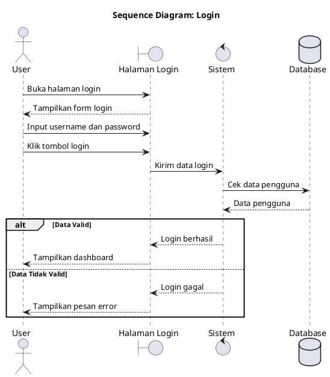

**Aktor:** Admin, Koordinator, PPK, Pimpinan, Pelaksana

---

## 2. Kelola Data Pengguna

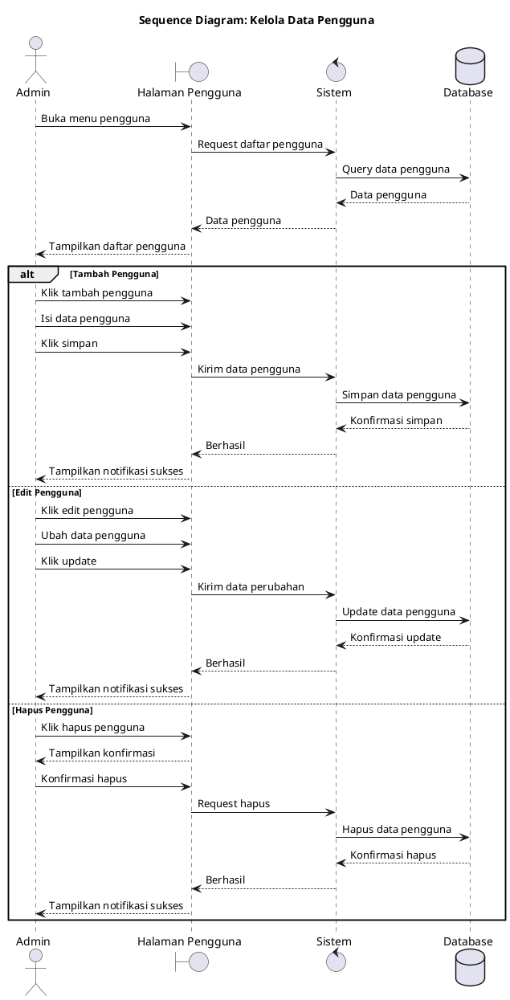

**Aktor:** Admin

---

## 3. Kelola Data Master

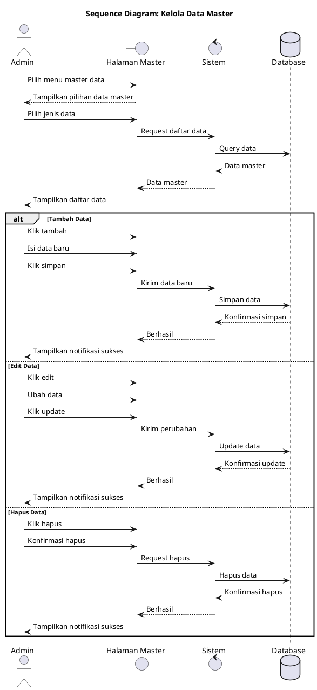

**Aktor:** Admin

---

## 4. Tambah Kegiatan

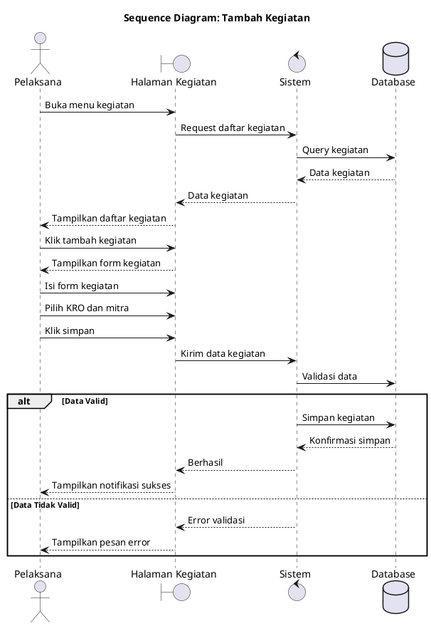

**Aktor:** Pelaksana

---

## 5. Ajukan Approval Kegiatan

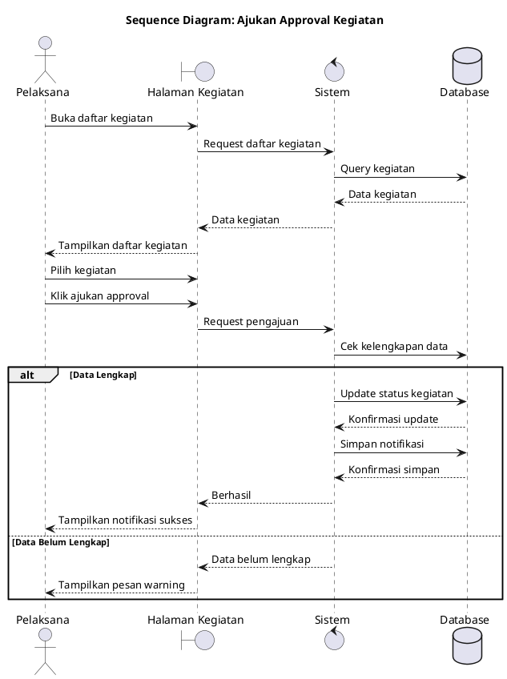

**Aktor:** Pelaksana

---

## 6. Update Progres

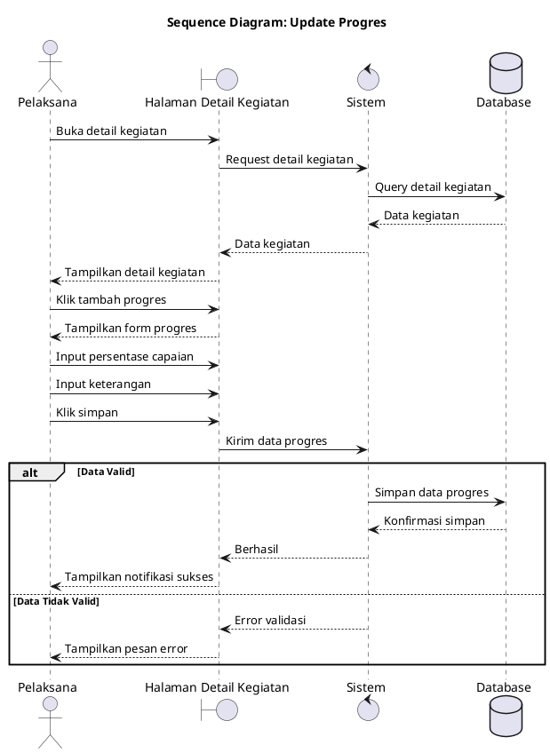

**Aktor:** Pelaksana

---

## 7. Ajukan Validasi Output

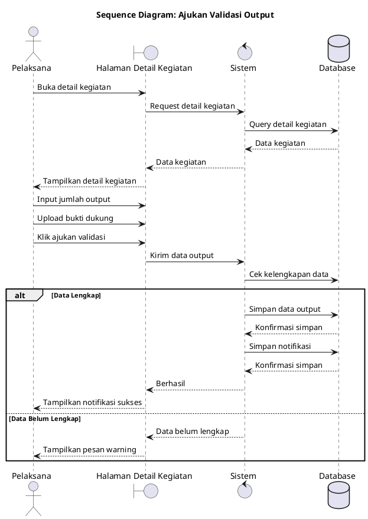

**Aktor:** Pelaksana

---

## 8. Unggah Laporan

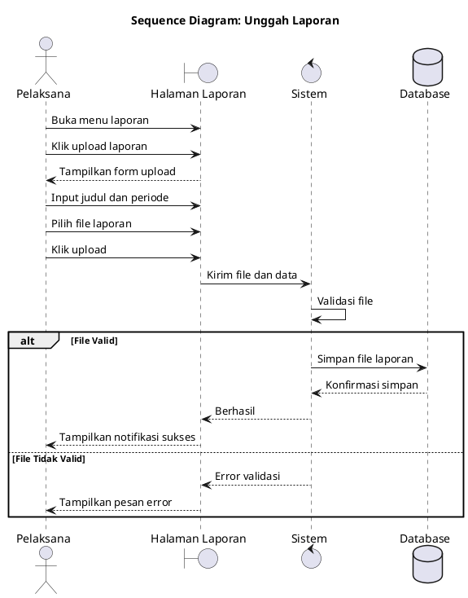

**Aktor:** Pelaksana

---

## 9. Approval Kegiatan

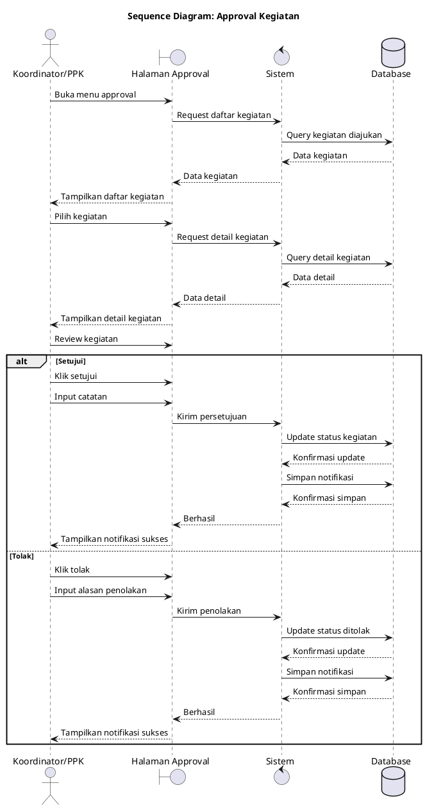

**Aktor:** Koordinator, PPK

---

## 10. Monitoring Kegiatan

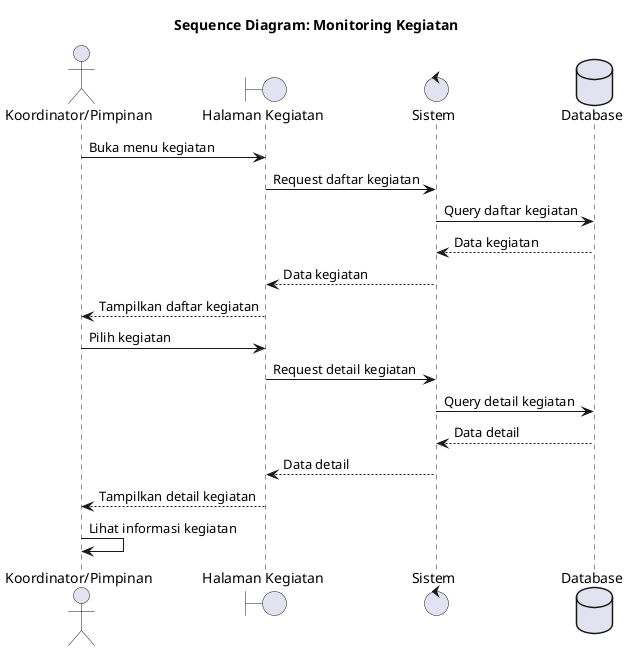

**Aktor:** Koordinator, Pimpinan

---

## 11. Validasi Output

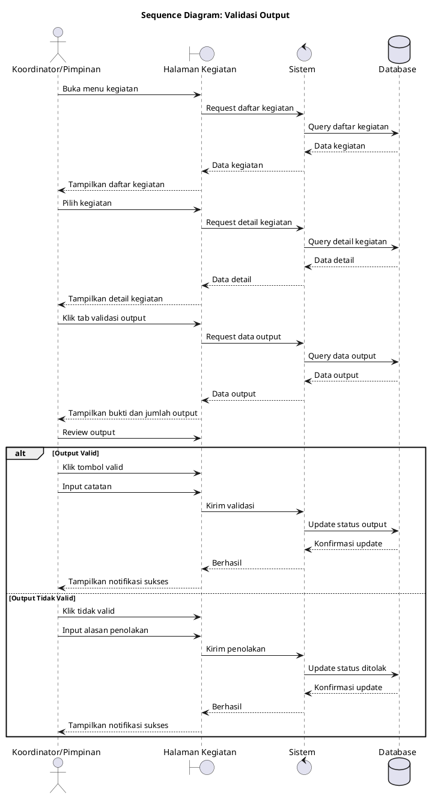

**Aktor:** Koordinator, Pimpinan

---

## 12. Tambah Evaluasi

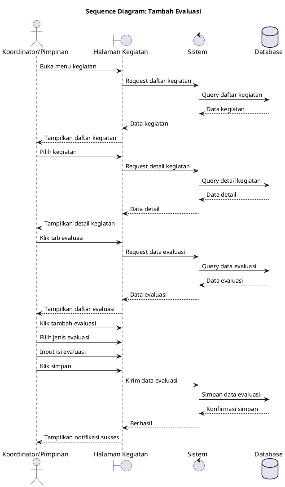

**Aktor:** Koordinator, Pimpinan

---

## 13. Lihat Laporan

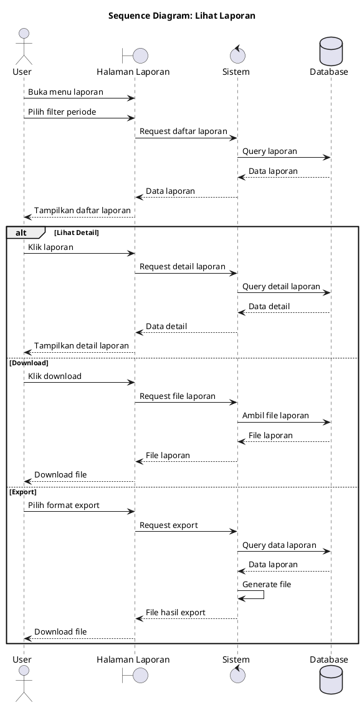

**Aktor:** Koordinator, PPK, Pimpinan

---

## Ringkasan Sequence Diagram

| No  | Diagram                  | Aktor                      | Use Case           |
| --- | ------------------------ | -------------------------- | ------------------ |
| 1   | Login                    | Semua User                 | Login              |
| 2   | Kelola Data Pengguna     | Admin                      | Kelola Data Master |
| 3   | Kelola Data Master       | Admin                      | Kelola Data Master |
| 4   | Tambah Kegiatan          | Pelaksana                  | Kelola Kegiatan    |
| 5   | Ajukan Approval Kegiatan | Pelaksana                  | Kelola Kegiatan    |
| 6   | Update Progres           | Pelaksana                  | Kelola Kegiatan    |
| 7   | Ajukan Validasi Output   | Pelaksana                  | Ajukan Validasi    |
| 8   | Unggah Laporan           | Pelaksana                  | Export Laporan     |
| 9   | Approval Kegiatan        | Koordinator, PPK           | Review Kegiatan    |
| 10  | Monitoring Kegiatan      | Koordinator, Pimpinan      | Lihat Statistik    |
| 11  | Validasi Output          | Koordinator, Pimpinan      | Validasi Output    |
| 12  | Tambah Evaluasi          | Koordinator, Pimpinan      | Evaluasi Kinerja   |
| 13  | Lihat Laporan            | Koordinator, PPK, Pimpinan | Export Laporan     |

---

## Cara Generate Diagram

1. **Online**: https://www.plantuml.com/plantuml/uml/
2. **VS Code**: Install extension "PlantUML"
3. **Command**: `java -jar plantuml.jar file.puml`
