# Sequence Diagram (PlantUML) - SIMKINERJA

## 1. Sequence Diagram Login

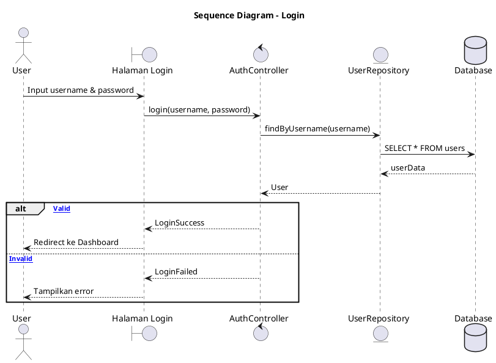

---

## 2. Sequence Diagram Buat Kegiatan

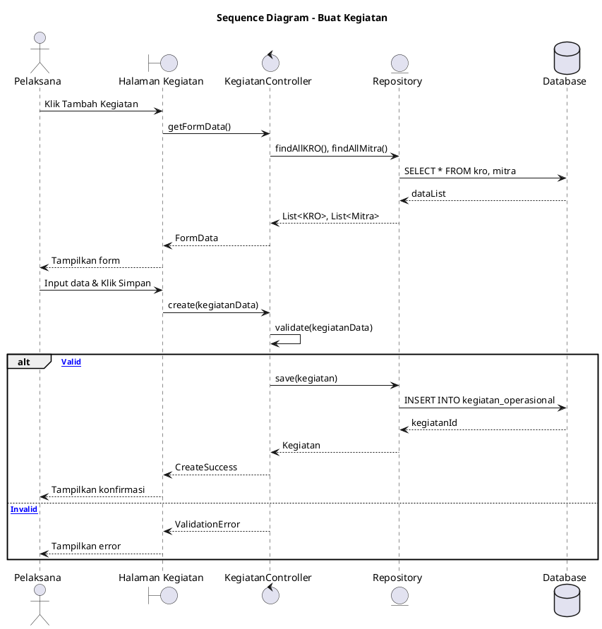

---

## 3. Sequence Diagram Input Progres

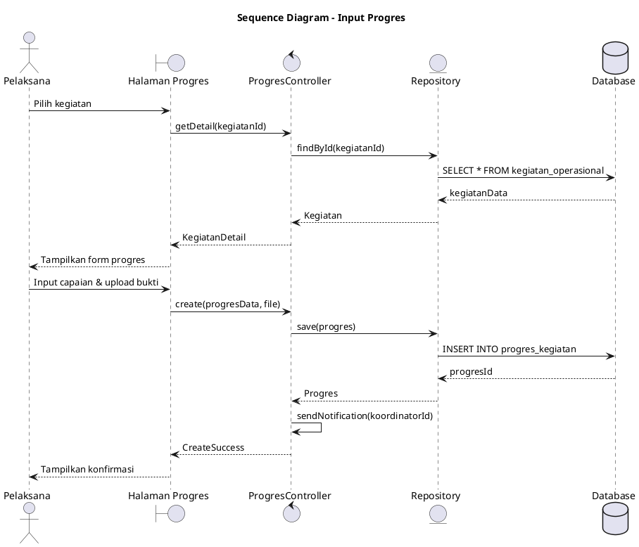

---

## 4. Sequence Diagram Ajukan Validasi

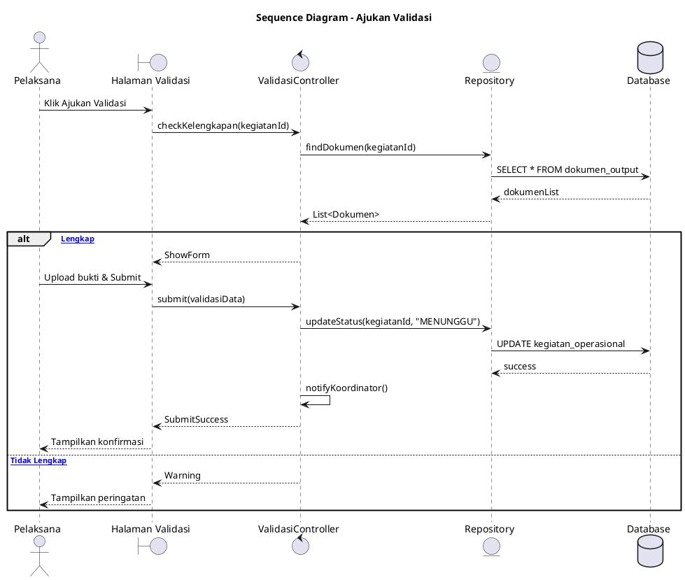

---

## 5. Sequence Diagram Validasi Output (Koordinator)

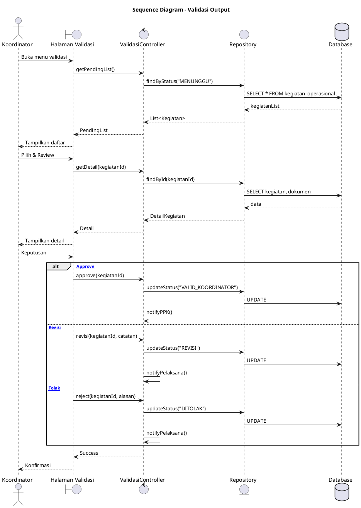

---

## 6. Sequence Diagram Verifikasi Anggaran (PPK)

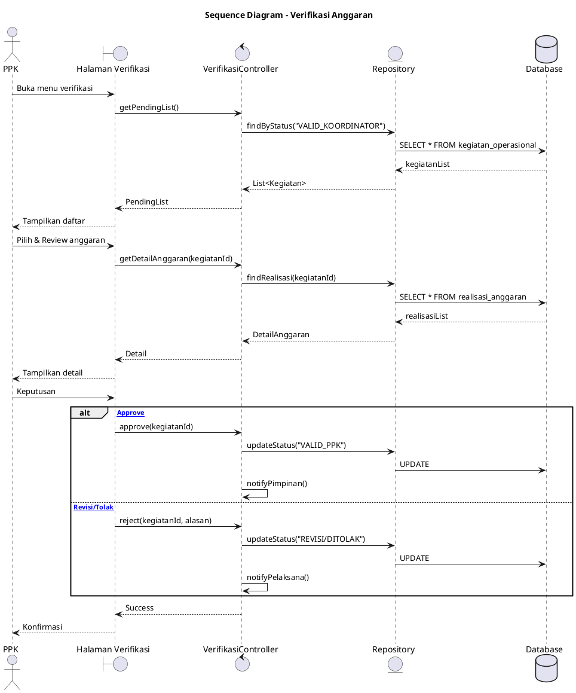

---

## 7. Sequence Diagram Pengesahan Final (Pimpinan)

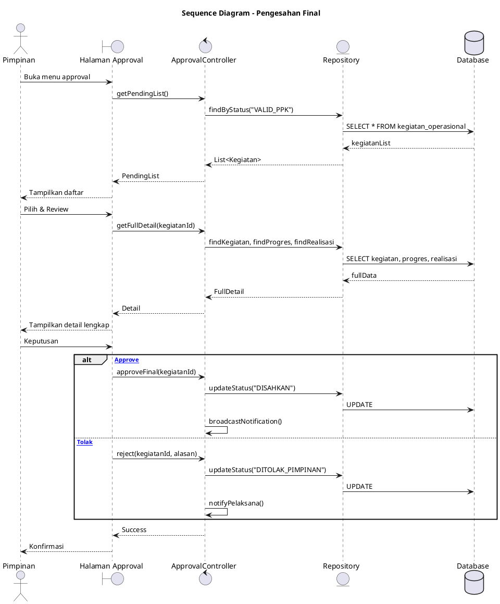

---

## 8. Sequence Diagram Evaluasi Kinerja (Pimpinan)

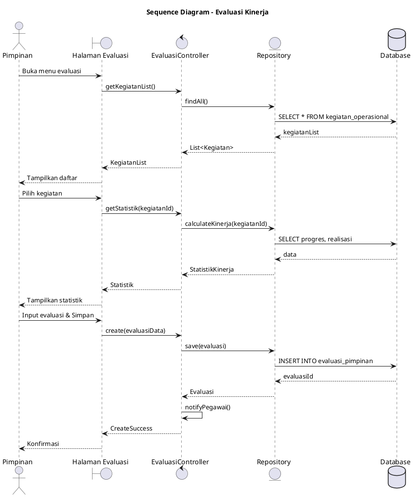

---

## 9. Sequence Diagram Kelola Data Master (Admin) - CRUD

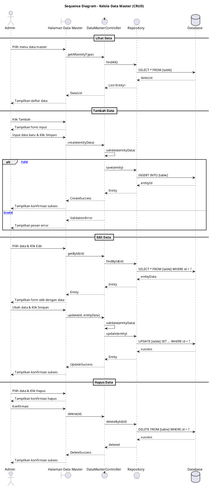

---

## 10. Sequence Diagram Lapor Kendala

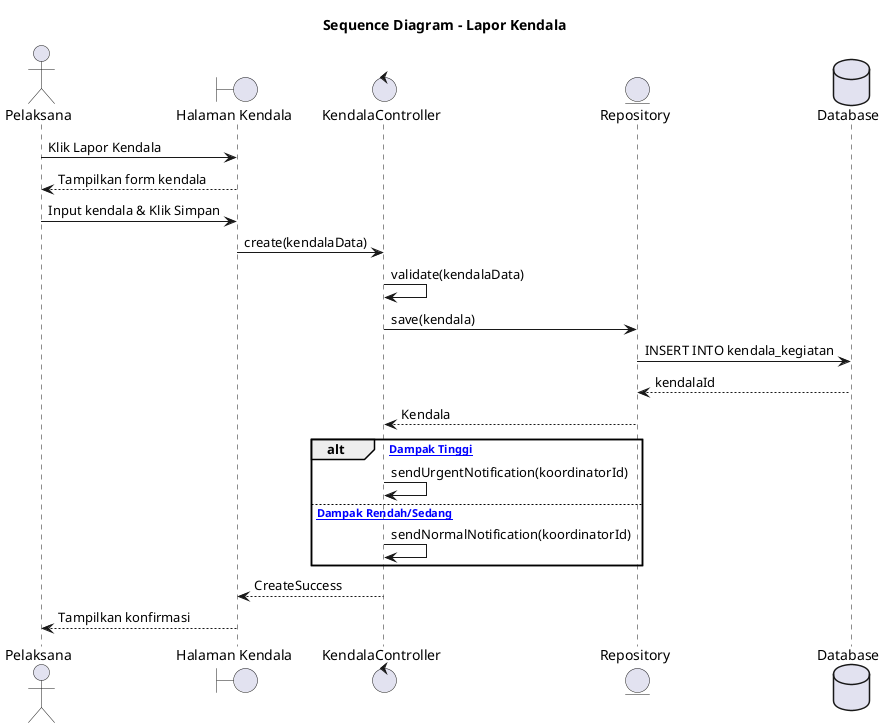

---

## 11. Sequence Diagram Alur Approval Multi-Level

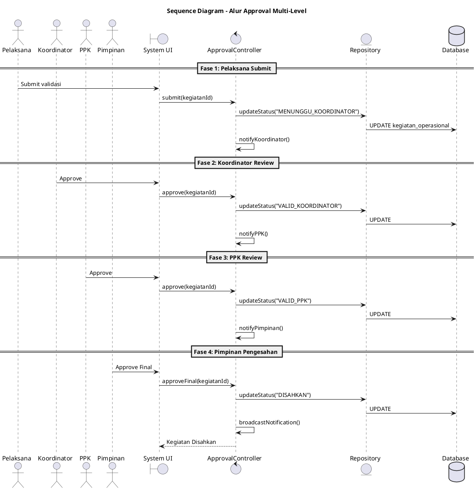

---

## Cara Melihat Diagram

1. Copy kode PlantUML di atas
2. Buka [PlantUML Online Editor](https://www.plantuml.com/plantuml/uml/)
3. Paste kode untuk melihat visualisasi

---

## Keterangan Komponen

| Komponen     | Simbol             | Deskripsi       |
| ------------ | ------------------ | --------------- |
| **Actor**    | `actor`            | Pengguna sistem |
| **Boundary** | `boundary`         | Interface/UI    |
| **Control**  | `control`          | Controller      |
| **Entity**   | `entity`           | Repository      |
| **Database** | `database`         | Database        |
| **Message**  | `->`               | Request         |
| **Return**   | `-->`              | Response        |
| **Alt**      | `alt...else...end` | Kondisi         |
| **Divider**  | `== text ==`       | Pembatas        |
