# Use Case Diagram - SIMKINERJA

## Use Case Diagram (5 Role)

```mermaid
flowchart LR
    subgraph Actors
        A1((Admin))
        A2((Pimpinan))
        A3((PPK))
        A4((Koordinator))
        A5((Pelaksana))
    end

    subgraph UC["SIMKINERJA"]
        subgraph Umum["Use Case Umum"]
            UC1[Login]
            UC2[Logout]
            UC3[Kelola Profil]
            UC4[Ganti Password]
            UC5[Lihat Dashboard]
            UC6[Lihat Notifikasi]
        end

        subgraph Pelaksana_UC["Use Case Pelaksana"]
            UC10[Buat Kegiatan]
            UC11[Input Progres]
            UC12[Upload Dokumen Output]
            UC13[Input Realisasi Anggaran]
            UC14[Ajukan Validasi]
            UC15[Lapor Kendala]
            UC16[Buat Tindak Lanjut]
        end

        subgraph Koordinator_UC["Use Case Koordinator"]
            UC20[Review Kegiatan]
            UC21[Validasi Output]
            UC22[Lihat Statistik Tim]
        end

        subgraph PPK_UC["Use Case PPK"]
            UC30[Verifikasi Anggaran]
            UC31[Approve Realisasi]
            UC32[Lihat Laporan Anggaran]
        end

        subgraph Pimpinan_UC["Use Case Pimpinan"]
            UC40[Pengesahan Final]
            UC41[Evaluasi Kinerja]
            UC42[Lihat Statistik Keseluruhan]
            UC43[Export Laporan]
        end

        subgraph Admin_UC["Use Case Admin"]
            UC50[Kelola Users]
            UC51[Kelola Tim]
            UC52[Kelola KRO]
            UC53[Kelola Mitra]
            UC54[Kelola Satuan Output]
            UC55[Kelola Indikator]
        end
    end

    %% Admin connections
    A1 --- UC1
    A1 --- UC2
    A1 --- UC3
    A1 --- UC4
    A1 --- UC5
    A1 --- UC6
    A1 --- UC50
    A1 --- UC51
    A1 --- UC52
    A1 --- UC53
    A1 --- UC54
    A1 --- UC55

    %% Pimpinan connections
    A2 --- UC1
    A2 --- UC2
    A2 --- UC3
    A2 --- UC4
    A2 --- UC5
    A2 --- UC6
    A2 --- UC40
    A2 --- UC41
    A2 --- UC42
    A2 --- UC43

    %% PPK connections
    A3 --- UC1
    A3 --- UC2
    A3 --- UC3
    A3 --- UC4
    A3 --- UC5
    A3 --- UC6
    A3 --- UC30
    A3 --- UC31
    A3 --- UC32

    %% Koordinator connections
    A4 --- UC1
    A4 --- UC2
    A4 --- UC3
    A4 --- UC4
    A4 --- UC5
    A4 --- UC6
    A4 --- UC20
    A4 --- UC21
    A4 --- UC22

    %% Pelaksana connections
    A5 --- UC1
    A5 --- UC2
    A5 --- UC3
    A5 --- UC4
    A5 --- UC5
    A5 --- UC6
    A5 --- UC10
    A5 --- UC11
    A5 --- UC12
    A5 --- UC13
    A5 --- UC14
    A5 --- UC15
    A5 --- UC16
```

---

## Daftar Aktor

| No  | Aktor       | Deskripsi                                            |
| --- | ----------- | ---------------------------------------------------- |
| 1   | Admin       | Administrator sistem yang mengelola data master      |
| 2   | Pimpinan    | Kepala unit yang memberikan pengesahan final         |
| 3   | PPK         | Pejabat Pembuat Komitmen yang verifikasi anggaran    |
| 4   | Koordinator | Pejabat yang mengkoordinir dan mereview kegiatan tim |
| 5   | Pelaksana   | Staf yang melaksanakan kegiatan operasional          |

---

## Daftar Use Case

### Use Case Umum (Semua Role)

| No  | Use Case         | Deskripsi                     |
| --- | ---------------- | ----------------------------- |
| 1   | Login            | Masuk ke sistem               |
| 2   | Logout           | Keluar dari sistem            |
| 3   | Kelola Profil    | Mengubah data profil pengguna |
| 4   | Ganti Password   | Mengubah password akun        |
| 5   | Lihat Dashboard  | Melihat ringkasan informasi   |
| 6   | Lihat Notifikasi | Melihat notifikasi sistem     |

### Use Case Pelaksana

| No  | Use Case                 | Deskripsi                              |
| --- | ------------------------ | -------------------------------------- |
| 7   | Buat Kegiatan            | Membuat kegiatan operasional baru      |
| 8   | Input Progres            | Menginput progres pelaksanaan kegiatan |
| 9   | Upload Dokumen Output    | Mengupload bukti/dokumen output        |
| 10  | Input Realisasi Anggaran | Menginput realisasi anggaran           |
| 11  | Ajukan Validasi          | Mengajukan validasi output ke atasan   |
| 12  | Lapor Kendala            | Melaporkan kendala kegiatan            |
| 13  | Buat Tindak Lanjut       | Membuat tindak lanjut atas kendala     |

### Use Case Koordinator

| No  | Use Case            | Deskripsi                        |
| --- | ------------------- | -------------------------------- |
| 14  | Review Kegiatan     | Mereview kegiatan dari pelaksana |
| 15  | Validasi Output     | Memvalidasi output kegiatan      |
| 16  | Lihat Statistik Tim | Melihat statistik kinerja tim    |

### Use Case PPK

| No  | Use Case               | Deskripsi                          |
| --- | ---------------------- | ---------------------------------- |
| 17  | Verifikasi Anggaran    | Memverifikasi kesesuaian anggaran  |
| 18  | Approve Realisasi      | Menyetujui realisasi anggaran      |
| 19  | Lihat Laporan Anggaran | Melihat laporan realisasi anggaran |

### Use Case Pimpinan

| No  | Use Case                    | Deskripsi                            |
| --- | --------------------------- | ------------------------------------ |
| 20  | Pengesahan Final            | Memberikan pengesahan akhir kegiatan |
| 21  | Evaluasi Kinerja            | Memberikan evaluasi kinerja pegawai  |
| 22  | Lihat Statistik Keseluruhan | Melihat statistik seluruh unit       |
| 23  | Export Laporan              | Mengekspor laporan dalam format file |

### Use Case Admin

| No  | Use Case             | Deskripsi                            |
| --- | -------------------- | ------------------------------------ |
| 24  | Kelola Users         | Mengelola data pengguna sistem       |
| 25  | Kelola Tim           | Mengelola data tim/bagian            |
| 26  | Kelola KRO           | Mengelola klasifikasi rincian output |
| 27  | Kelola Mitra         | Mengelola data mitra statistik       |
| 28  | Kelola Satuan Output | Mengelola satuan output kegiatan     |
| 29  | Kelola Indikator     | Mengelola indikator kinerja          |

---

## Keterangan Simbol

| Simbol     | Arti                             |
| ---------- | -------------------------------- |
| `(( ))`    | Actor (Aktor/Pengguna)           |
| `[ ]`      | Use Case (Fungsi sistem)         |
| `---`      | Association (Aktor mengakses UC) |
| `subgraph` | Grouping/Boundary sistem         |
