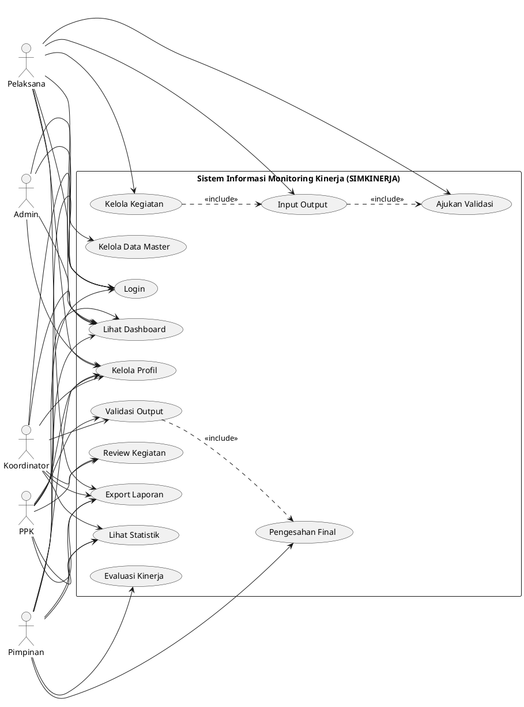

# Use Case Diagram - Sistem Informasi Monitoring Kinerja

Dokumen ini berisi Use Case Diagram untuk **Sistem Informasi Monitoring Kinerja (SIMKINERJA)**.

---

## Diagram Use Case Sistem

**Cara Melihat Diagram:**

1. Copy kode PlantUML di atas
2. Buka [PlantUML Online Editor](https://www.plantuml.com/plantuml/uml/)
3. Paste kode untuk melihat visualisasi diagram

---

## Deskripsi Aktor

| No  | Aktor           | Deskripsi                                             |
| --- | --------------- | ----------------------------------------------------- |
| 1   | **Pelaksana**   | Staf yang melaksanakan kegiatan operasional           |
| 2   | **Koordinator** | Pejabat yang mengkoordinir dan mereview kegiatan tim  |
| 3   | **PPK**         | Pejabat Pembuat Komitmen yang mereview aspek anggaran |
| 4   | **Pimpinan**    | Kepala unit yang memberikan pengesahan final          |
| 5   | **Admin**       | Administrator sistem yang mengelola data master       |

---

## Deskripsi Use Case

| Kode | Use Case           | Deskripsi                                       | Aktor                                 |
| ---- | ------------------ | ----------------------------------------------- | ------------------------------------- |
| UC1  | Login              | Masuk ke sistem                                 | Semua                                 |
| UC2  | Kelola Profil      | Mengubah informasi profil pengguna              | Semua                                 |
| UC3  | Lihat Dashboard    | Melihat ringkasan statistik                     | Semua                                 |
| UC4  | Kelola Kegiatan    | Membuat, edit, hapus, dan ajukan kegiatan       | Pelaksana                             |
| UC5  | Input Output       | Memasukkan kuantitas atau upload dokumen output | Pelaksana                             |
| UC6  | Ajukan Validasi    | Mengajukan output untuk divalidasi              | Pelaksana                             |
| UC7  | Review Kegiatan    | Mereview dan setujui/tolak pengajuan kegiatan   | Koordinator, PPK                      |
| UC8  | Validasi Output    | Memvalidasi output yang dilaporkan              | Koordinator, PPK                      |
| UC9  | Pengesahan Final   | Memberikan pengesahan akhir atas output         | Pimpinan                              |
| UC10 | Lihat Statistik    | Melihat grafik dan analisis kinerja             | Koordinator, PPK, Pimpinan            |
| UC11 | Export Laporan     | Mengunduh laporan Excel/PDF                     | Pelaksana, Koordinator, PPK, Pimpinan |
| UC12 | Evaluasi Kinerja   | Memberikan evaluasi kinerja pelaksana           | Pimpinan                              |
| UC13 | Kelola Data Master | Mengelola pengguna, tim, KRO, mitra             | Admin                                 |

---

## Relasi Include

| Use Case Utama  | Include          | Keterangan                                        |
| --------------- | ---------------- | ------------------------------------------------- |
| Kelola Kegiatan | Input Output     | Setelah kegiatan dibuat, pelaksana input output   |
| Input Output    | Ajukan Validasi  | Output yang sudah diinput perlu diajukan validasi |
| Validasi Output | Pengesahan Final | Output yang valid perlu disahkan pimpinan         |
